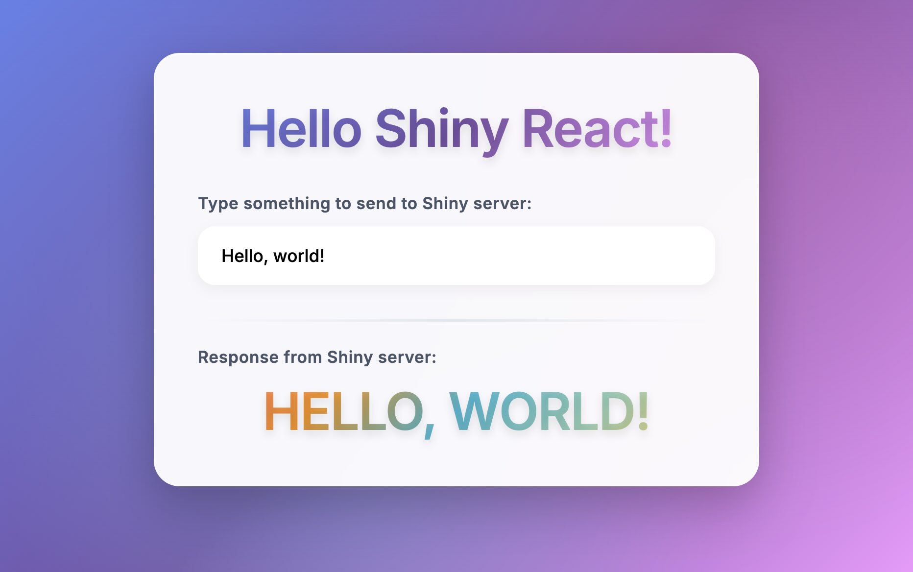
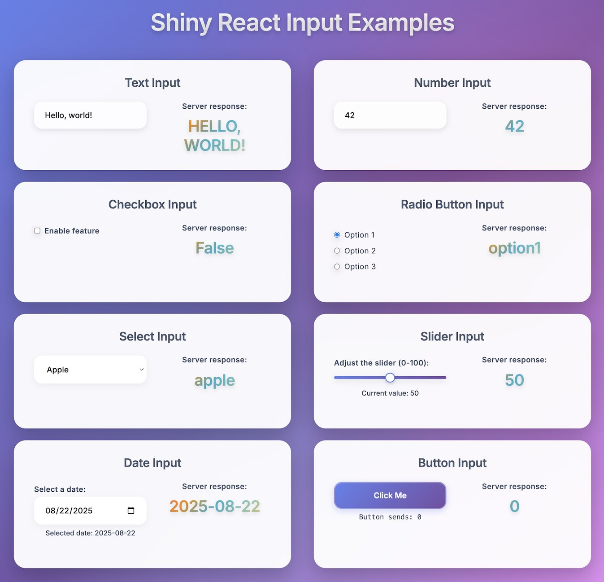
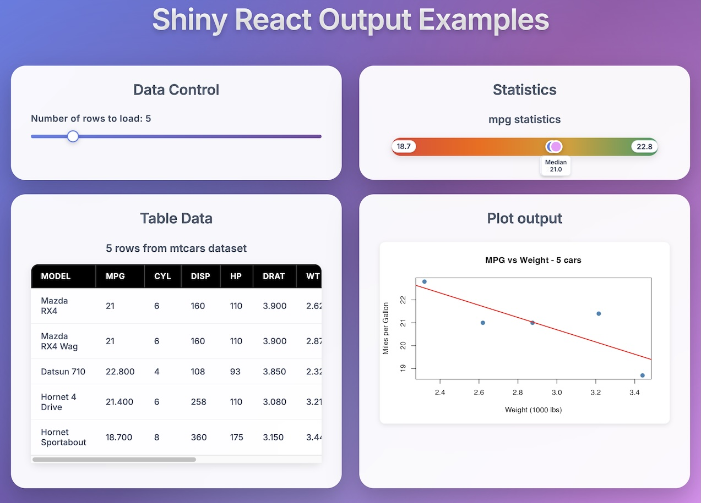
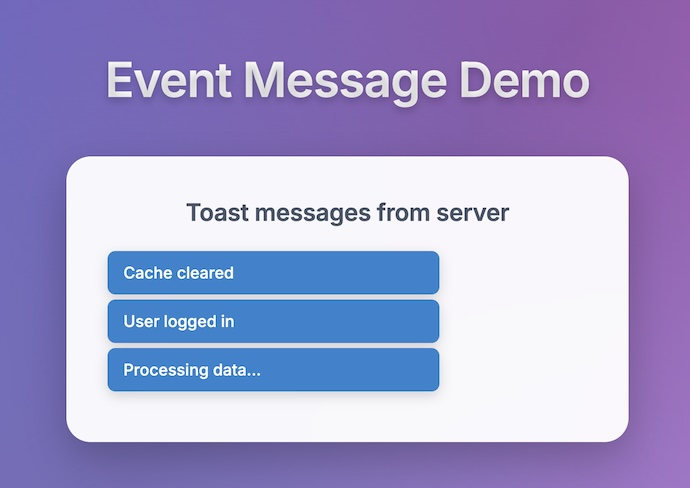
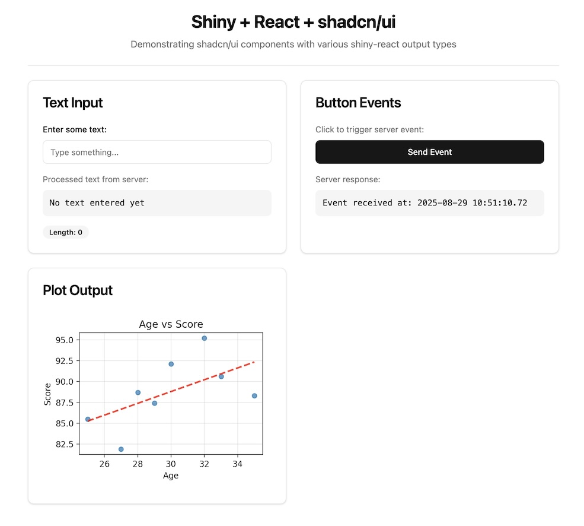
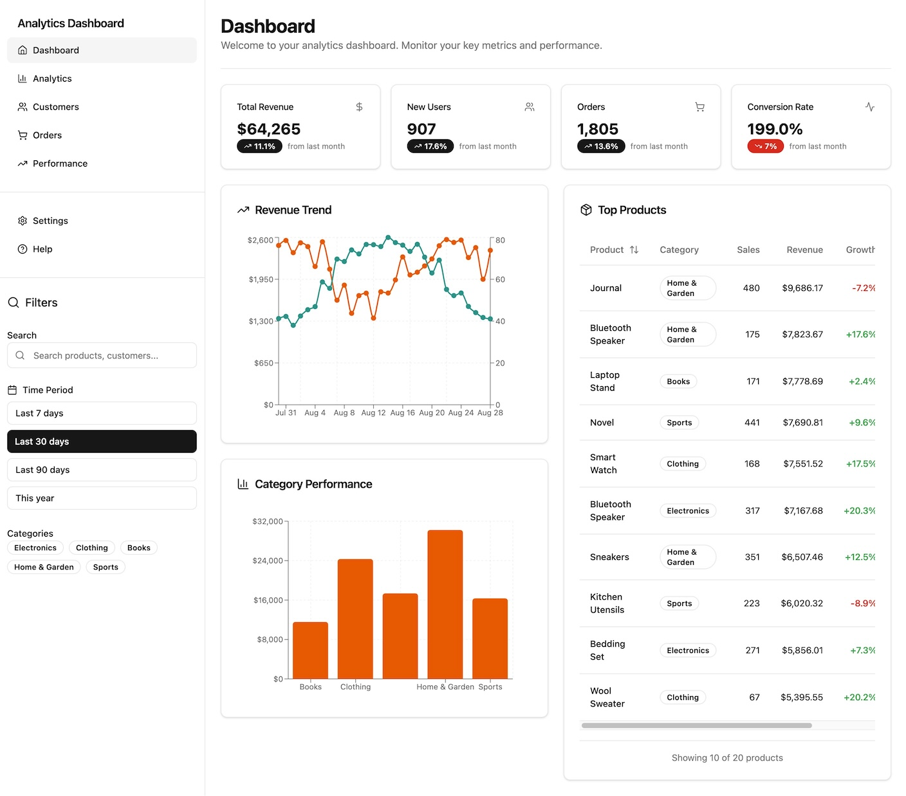
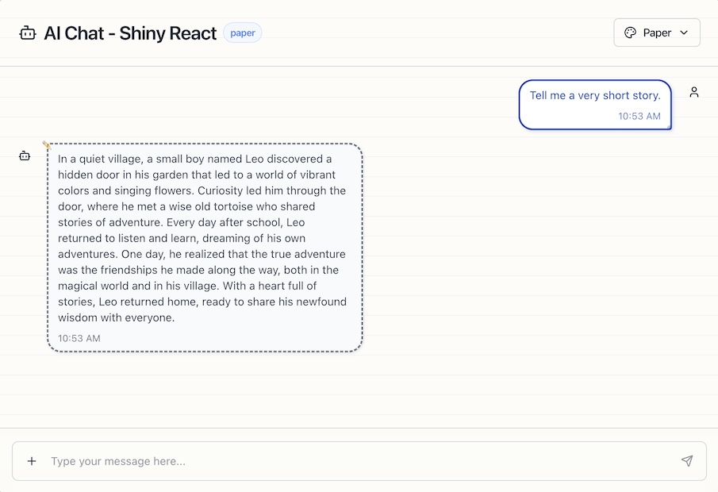

Shiny React (experimental!)
===========

React bindings library for Shiny applications, providing TypeScript/JavaScript hooks and components for bidirectional communication between React components and Shiny servers (both R and Python).

The library enables React components to send data to and receive data from Shiny server functions through custom hooks and output bindings.

## Installation

Note that this library is not yet available on npm. It must be built from source for now.


## Building the Library

```bash
# Install dependencies
npm install

# Build the library
npm run build
# Or for development with watch mode
npm run watch
```

## Architecture

### Core Components

- **`useShinyInput<T>()`** - Hook to send data from React to Shiny server
- **`useShinyOutput<T>()`** - Hook to receive data from Shiny server
- **`ShinyReactRegistry`** - Global registry managing input/output mappings and debounced updates
- **`ReactOutputBinding`** - Custom Shiny output binding class for React components

### Key Features

1. **Promise-based Initialization**: Components wait for `window.Shiny.initializedPromise` before establishing connections
2. **Debounced Updates**: Input changes are debounced (100ms) before sending to Shiny server
3. **Dual Package Support**: Compatible with both CommonJS (`require()`) and ESM (`import`) module systems
4. **TypeScript Support**: Full TypeScript declarations included

## Examples

### Hello World Example

The [examples/1-hello-world/](examples/1-hello-world/) directory contains a simple example demonstrating basic Shiny-React usage with both R and Python Shiny applications. The Shiny back end simply capitalizes the input value and sends it back to the front end.



### Input Component Examples

The [examples/2-inputs/](examples/2-inputs/) directory showcases various input components and their integration with Shiny. This comprehensive example demonstrates:

- **Text Input** - Basic text input with server-side transformation
- **Number Input** - Numeric input with range constraints
- **Checkbox Input** - Boolean checkbox for true/false values
- **Radio Button Input** - Single selection from multiple options
- **Select Input** - Dropdown selection from a list of choices
- **Slider Input** - Range slider for numeric values with visual feedback
- **Date Input** - HTML5 date picker for date selection
- **Button Input** - Click counter demonstrating event handling

Each component follows consistent patterns and demonstrates real-time bidirectional communication between React and Shiny.



### Output Examples

The [examples/3-outputs/](examples/3-outputs/) directory demonstrates outputs that consist of arbitrary JSON data, as well as plot outputs.



### Server-to-Client Messages Example

The [examples/4-messages/](examples/4-messages/) directory showcases advanced server-to-client communication patterns using custom message handlers. This example demonstrates how Shiny servers can proactively send messages to React components for real-time notifications, status updates, and other server-initiated events.

Key features demonstrated:
- **Custom Message Handlers** - Registering handlers for specific message types
- **Server-Initiated Communication** - Messages sent from server without user input
- **Real-time Updates** - Live notifications and status changes
- **Toast Notifications** - User-friendly message display system



### Modern UI with shadcn/ui Components

The [examples/5-shadcn/](examples/5-shadcn/) directory demonstrates building modern, professional UIs using [shadcn/ui](https://ui.shadcn.com/) components with Tailwind CSS. This example shows how to integrate popular React component libraries with Shiny-React applications.

Key features demonstrated:
- **shadcn/ui Components** - Professional, accessible UI components
- **Tailwind CSS Integration** - Modern utility-first styling
- **Component Composition** - Building complex UIs from simple components
- **Theme System** - Customizable design tokens and styling
- **TypeScript Integration** - Full type safety with component props



### Interactive Dashboard

The [examples/6-dashboard/](examples/6-dashboard/) directory presents a comprehensive dashboard application with charts, tables, and interactive data visualization. This sophisticated example demonstrates how to build data-driven applications with Shiny-React.

Key features demonstrated:
- **Interactive Charts** - Dynamic data visualization with filtering
- **Data Tables** - Sortable, filterable tabular data display
- **Multi-Component Communication** - Coordinated updates across multiple UI elements
- **Real-time Data** - Live updates from server calculations
- **Responsive Design** - Modern dashboard layout with shadcn/ui components
- **Advanced State Management** - Complex data flow patterns



### AI Chat Application

The [examples/7-chat/](examples/7-chat/) directory showcases an advanced AI chat application with multi-modal input support, dynamic theming, and LLM integration. This production-ready example demonstrates sophisticated patterns for building modern conversational interfaces.

Key features demonstrated:
- **Multi-modal Input** - Text and image attachments support
- **Streaming Responses** - Real-time AI response streaming
- **Dynamic Themes** - Multiple theme variants with live switching
- **File Upload** - Drag-and-drop image handling
- **LLM Integration** - Compatible with OpenAI API (R: ellmer, Python: chatlas)
- **Advanced UI Patterns** - Professional chat interface with shadcn/ui
- **Custom Message Handlers** - Server-initiated streaming communication



### Running the Examples

For any example, build the JavaScript and CSS for the React application:

```bash
# Choose any example directory:
cd examples/1-hello-world        # Basic communication
cd examples/2-inputs             # Input components
cd examples/3-outputs            # Output components
cd examples/4-messages           # Server messages
cd examples/5-shadcn             # shadcn/ui components
cd examples/6-dashboard          # Interactive dashboard
cd examples/7-chat               # AI chat application

# Install dependencies
npm install

# Build the React application
npm run build
# Or for development with watch mode
npm run watch
```

In another terminal, run either the R or Python Shiny application:

```bash
# For R
R -e "options(shiny.autoreload = TRUE); shiny::runApp('r/app.R', port=8000)"

# For Python
shiny run py/app.py --port 8000
```

Open your browser to `http://localhost:8000`

## Quick Start with CLI Tool

The easiest way to create a new Shiny-React application is using the included CLI tool:

```bash
npx shiny-react create-shiny-react-app my-app
```

The CLI will interactively prompt you to:
1. **Choose from 7 example templates:**
   - **Hello World** - Basic bidirectional communication
   - **Input Components** - Comprehensive input showcase  
   - **Output Components** - Data visualization demo
   - **Server Messages** - Messaging patterns
   - **shadcn/ui Components** - Modern UI components
   - **Dashboard** - Full dashboard with charts
   - **AI Chat** - LLM integration example

2. **Optionally include CLAUDE.md** - Comprehensive documentation for LLM coding assistance

After creation, simply:
```bash
cd my-app
npm install
npm run watch    # Start development with hot reload
```

Then in another terminal:
```bash
# For R backend
R -e "options(shiny.autoreload = TRUE); shiny::runApp('r/app.R', port=8000)"

# For Python backend  
shiny run py/app.py --port 8000 --reload
```

Open `http://localhost:8000` in your browser.


## Usage

With Shiny-React, the front end is written in React, while the back end is written with Shiny in R or Python. 

The front end sends values to the back end using the `useShinyInput` hook. This is similar to React's `useState` hook in that there is a state variable and a setter function, but the setter does an additional thing: it sends the value to the R/Python Shiny backend as a Shiny input value.

The back end sends data to the front end by setting Shiny output values just like in any other Shiny app. The front end reads output values with the `useShinyOutput` hook.

Here is an example of a React component for the front end:

```typescript
import { useShinyInput, useShinyOutput } from 'shiny-react';

function MyComponent() {
  // Input values sent to Shiny
  const [inputValue, setInputValue] = useShinyInput<string>("my_input", "default value");

  // Output values received from Shiny
  const [outputValue, outputRecalculating] = useShinyOutput<string>("my_output", undefined);

  return (
    <div>
      <input
        value={inputValue}
        onChange={(e) => setInputValue(e.target.value)}
      />
      <div>{outputValue}</div>
    </div>
  );
}
```

Here is a corresponding Shiny server function for the back end, written in R:

```r
function(input, output, session) {
  output$my_output <- renderText({
    toupper(input$my_input)
  })
}
```

And the same thing in Python:

```python
def server(input, output, session):
    @render.text()
    def my_output():
        return input.my_input().upper()
```


Note that some other code is needed on the back end to create the complete Shiny app, including utility functions provided in `shinyreact.R` and `shinyreact.py`. See the complete examples in [examples/1-hello-world/](examples/1-hello-world/) for more details.

## Backend Utilities

### shinyreact.R and shinyreact.py

Each Shiny-React application includes utility files that provide essential functions for React integration:

**shinyreact.R** (R backend):
- `page_bare()` - Creates a bare HTML page without default Shiny styling, suitable for React applications
- `render_object()` - Custom renderer for sending arbitrary JSON data to React components

**shinyreact.py** (Python backend):
- `page_bare()` - Creates a bare HTML page without default Shiny styling, suitable for React applications  
- `@render_object` - Custom renderer for sending arbitrary JSON data to React components

### Sending Arbitrary JSON with `render_object`

`render_object` allows you to send complex data structures and arbitrary JSON to React components, going beyond simple text or plot outputs.

**R Usage:**
```r
# Send a data frame (automatically converted to column-major JSON format)
output$table_data <- render_object({
  mtcars[1:input$num_rows, ]
})

# Send custom JSON objects
output$statistics <- render_object({
  list(
    mean = mean(mtcars$mpg),
    median = median(mtcars$mpg),
    min = min(mtcars$mpg),
    max = max(mtcars$mpg)
  )
})
```

**Python Usage:**
```python
# Send a data frame (explicitly converted to column-major JSON format)
@render_object
def table_data():
    num_rows = input.table_rows()
    return mtcars.head(num_rows).to_dict(orient="list")

# Send custom JSON objects
@render_object
def statistics():
    return {
        "mean": float(mtcars["mpg"].mean()),
        "median": float(mtcars["mpg"].median()),
        "min": float(mtcars["mpg"].min()),
        "max": float(mtcars["mpg"].max())
    }
```

**React Frontend:**
```typescript
// Receive complex data structures
const [tableData] = useShinyOutput<Record<string, number[]>>("table_data", undefined);
const [stats] = useShinyOutput<{mean: number; median: number; min: number; max: number}>("statistics", undefined);
```

**Data Frame Format:** Data frames are serialized in **column-major format** as JSON objects where each column becomes a property with an array of values:
```json
{
  "mpg": [21, 21, 22.8, 21.4, ...],
  "cyl": [6, 6, 4, 6, ...], 
  "disp": [160, 160, 108, 258, ...]
}
```


## Docs

The concept behind Shiny-React is that it provides a way to write applications with a React front end and a Shiny back end. The front end uses React's reactivity, and the back end uses Shiny's reactivity. These are both forms of reactivity, but they have differences from each other.


Front end:
- Front end is written in React.
- `useShinyInput` hook
  - In order to send values to the Shiny back end, the front end can use the `useShinyInput` hook. This is similar to React's `useState` hook in that there is a state variable and a setter function, but the setter does an additional thing: it sends the value to the R/Python Shiny backend as a Shiny input value.
  - When the `useShinyInput` hook is used, it returns a tuple of the state variable and the setter function.
  - When the setter function is called, it both updates the state variable and sends the value to the Shiny back end as a Shiny input value. Values are deduplicated: if the value is identical to the previous value, then it does not send the value to the Shiny back end.
  - From the perspective of the front end, `useShinyInput` can be thought of as extending a state variable all the way to the server. The server can read this state variable, but it cannot modify it. (If it were able to modify this state variable, then there could be race conditions and synchronization problems, because of the async nature of the communication.)
- `useShinyOutput` hook
  - The front end also has a `useShinyOutput` hook, which returns a tuple containing the value of the Shiny output variable, and a boolean indicating whether the server is currently recalculating this output.
  - The Shiny output variable is set on the server; the front end can only read the value.


Back end:
- Back end is written in Shiny for R or Python.
- Shiny's reactivity system can be thought of as a directed graph of reactive values and reactive functions.
- Inputs values are received from the front end. They are **reactive values**, and so when they change, they cause re-execution of any reactive functions that depend on them.
  - In R, an input value can be accessed with `input$my_input`, without parentheses.
  - In Python, an input value can be accessed with `input.my_input()`, with parentheses.
- **Output values** are set by reactive functions, which automatically re-execute when their reactive inputs change. These output values are then sent to the front end.
  - In R, an output value can be set with:
    ```r
    output$my_output <- renderText({
      toupper(input$my_input)
    })
    ```
  - In Python, an output value can be set with:
    ```python
    @render.text()
    def my_output():
        return input.my_input().upper()
    ```
- Shiny also has reactive functions that automatically re-execute when their reactive inputs change, and their return values can be used by other reactive functions. These re-execute whenever their reactive inputs change, and the most recent value is cached.
  - In R, these are called **reactive expressions**, and are created with:
    ```r
    computed_value <- reactive({
      toupper(input$my_input)
    })
    ```
  - In Python, these are called **reactive calculations**, and are created with:
    ```python
    @reactive.calc
    def computed_value():
        return input.my_input().upper()
    ```
- Shiny also has reactive functions that are only used for **side effects** -- their return values are not used, but functions like these can be useful for doing things like writing data to disk, logging to the console, or sending network requests.
  - In R, these are called **reactive observers**, and are created with:
    ```r
    observe({
      write.csv(input$my_input, "data.csv")
    })
    ```
  - In Python, these are called **reactive effects**, and are created with:
    ```python
    @reactive.effect
    def _data_writer_effect():
        write.csv(input.my_input(), "data.csv")
    ```
