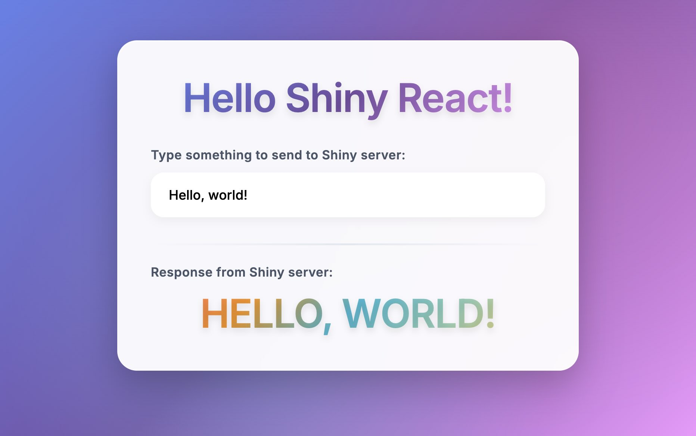
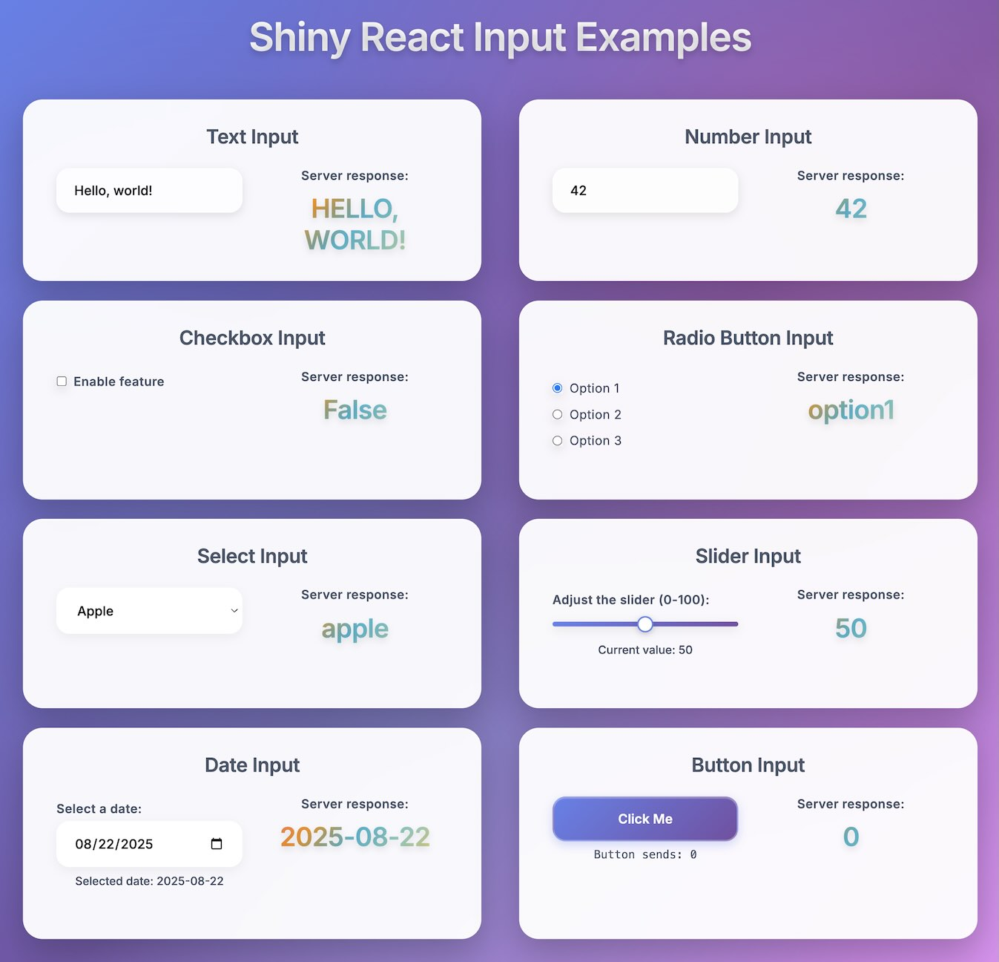
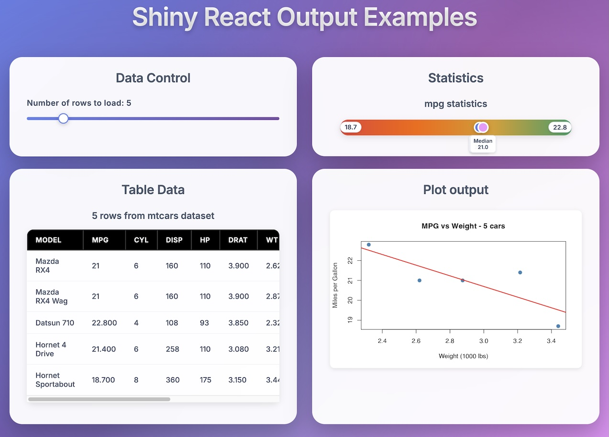
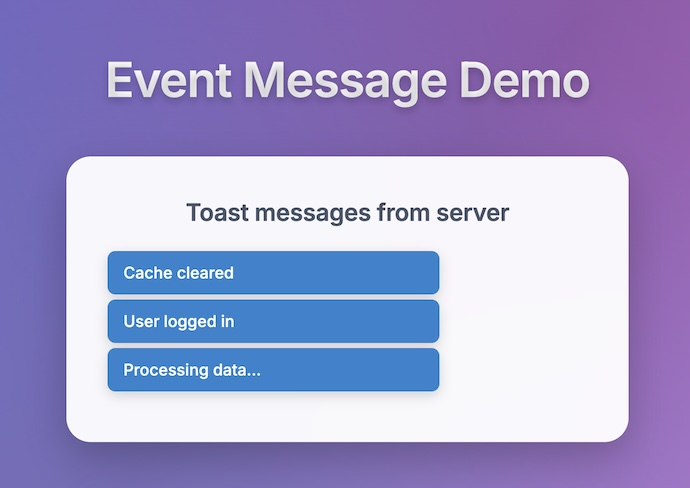
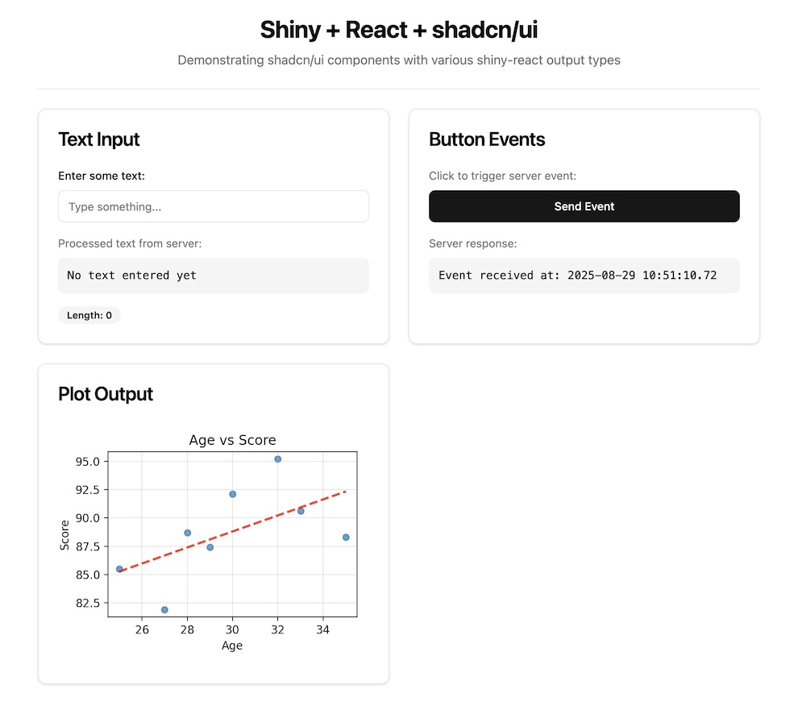
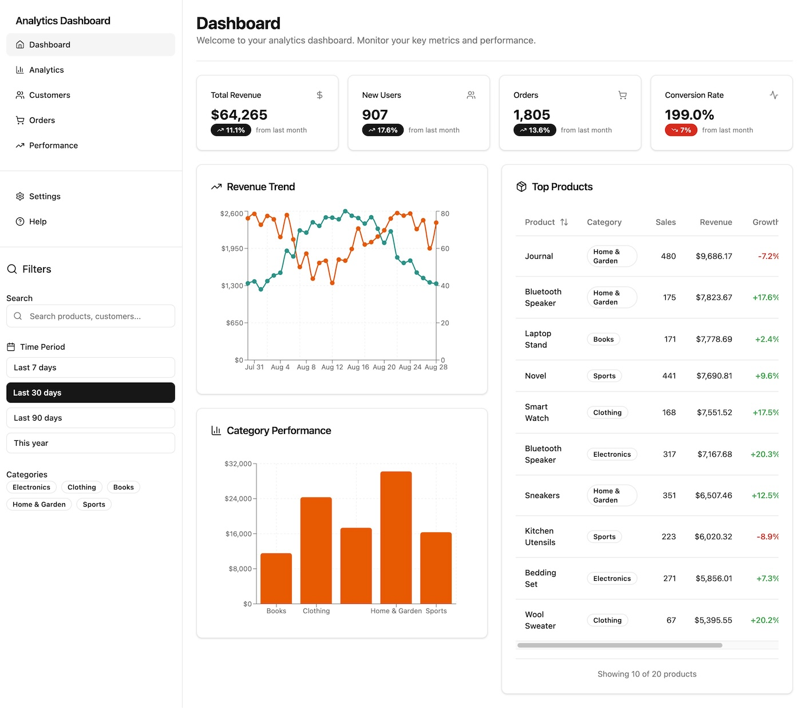
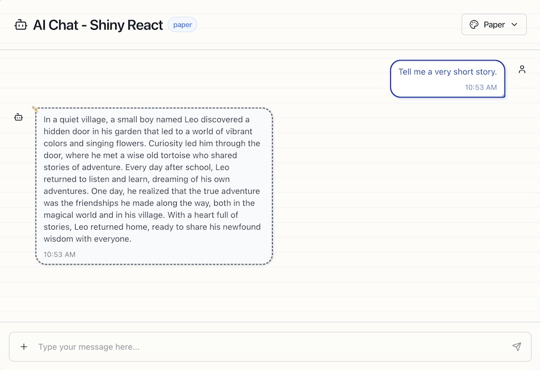

Shiny React (experimental!)
===========

React bindings library for Shiny applications, providing TypeScript/JavaScript hooks and components for bidirectional communication between React components and Shiny servers (both R and Python).

The library enables React components to send data to and receive data from Shiny server functions through custom hooks and output bindings.

## Quick Start

The easiest way to create a new Shiny-React application is to use [`create-shiny-react-app`](https://www.npmjs.com/package/create-shiny-react-app) to create a new app from a template:

```bash
# Create a new app in myapp/
npx create-shiny-react-app myapp
# You will be asked which template and which backend (R or Python) to use

cd myapp
npm install
npm run dev  # Builds frontend and starts Shiny app
```

The `npm run dev` command will build the frontend and start the Shiny app, and will automatically rebuild the frontend and reload the app when files change. By default it will use port 8000.

Open http://localhost:8000 in your browser to see your app.


You can change the port by setting the `PORT` environment variable:

```bash
PORT=8001 npm run dev
```


## Using Shiny-React with a Node.js project

To add shiny-react to an existing Node.js project, run:

```bash
npm install @posit/shiny-react
```

## Usage: basics

With Shiny-React, the front end is written in React, while the back end is written with Shiny in R or Python.

The front end sends values to the back end using the `useShinyInput` hook. This is similar to React's `useState` hook in that there is a state variable and a setter function, but the setter does an additional thing: it sends the value to the R/Python Shiny backend as a Shiny input value.

The back end sends data to the front end by setting Shiny output values just like in any other Shiny app. The front end reads output values with the `useShinyOutput` hook.

Here is an example of a React component for the front end:

```typescript
import { useShinyInput, useShinyOutput } from 'shiny-react';

function MyComponent() {
  // Input values sent to Shiny
  const [inputValue, setInputValue] = useShinyInput<string>("my_input", "default value");

  // Output values received from Shiny
  const [outputValue, outputRecalculating] = useShinyOutput<string>("my_output", undefined);

  return (
    <div>
      <input
        value={inputValue}
        onChange={(e) => setInputValue(e.target.value)}
      />
      <div>{outputValue}</div>
    </div>
  );
}
```

Here is a corresponding Shiny server function for the back end, written in R:

```r
function(input, output, session) {
  output$my_output <- render_json({
    toupper(input$my_input)
  })
}
```

And the same thing in Python:

```python
def server(input, output, session):
    @render_json
    def my_output():
        return input.my_input().upper()
```


## Creating Reusable React Widgets

For self-contained React widgets, extend `ShinyReactComponentElement` - a custom HTML element base class that handles React lifecycle, Shiny bindings, and namespace support automatically.

### Simple Widget

```typescript
import { ShinyReactComponentElement } from "@posit/shiny-react";
import { CounterWidget } from "./CounterWidget";

class CounterWidgetElement extends ShinyReactComponentElement {
  static component = CounterWidget;
}

if (!customElements.get("counter-widget")) {
  customElements.define("counter-widget", CounterWidgetElement);
}
```

That's it! The base class automatically:
- Creates a React root and renders your component
- Wraps in `ShinyModuleProvider` if the element has an `id` attribute
- Parses `data-*` attributes into props via `getConfig()` (with JSON auto-parsing)
- Cleans up React and Shiny bindings on disconnect

### Blended Components (React + Shiny Content)

For layouts where React controls the structure but Shiny provides the content (inputs, outputs, plots), use the slot system:

```typescript
import { ShinyReactComponentElement } from "@posit/shiny-react";
import { SidebarLayout } from "./SidebarLayout";

class SidebarLayoutElement extends ShinyReactComponentElement {
  protected render() {
    const config = this.getConfig();
    return (
      <SidebarLayout
        {...config}
        onSlotMount={this.onSlotMount}  // Pass the slot mounting callback
      />
    );
  }
}

if (!customElements.get("react-sidebar-layout")) {
  customElements.define("react-sidebar-layout", SidebarLayoutElement);
}
```

In your React component, call `onSlotMount(slotName, containerElement)` after the container mounts to move Shiny content into place.

**Slot naming:**
- Use `data-slot="name"` attributes in R/Python to create named slots
- If no `data-slot` elements exist, all children are captured as `__children__`

### Configuration via Data Attributes

The `getConfig()` method automatically parses `data-*` attributes:

```html
<my-widget data-count="5" data-enabled="true" data-items="[1,2,3]" data-title="Hello">
```

Becomes: `{ count: 5, enabled: true, items: [1,2,3], title: "Hello" }`

- Numbers and booleans are parsed from JSON
- Arrays and objects work via JSON
- Plain strings that aren't valid JSON stay as strings

### R/Python Widget APIs

Create clean Shiny APIs that pass attributes:

**R:**
```r
my_widget_ui <- function(id, title = "My Widget", initial_value = 0) {
  tagList(
    htmlDependency(...),  # Include your JS/CSS
    tag("my-widget", list(
      id = id,
      `data-title` = title,
      `data-initial-value` = initial_value
    ))
  )
}
```

**Python:**
```python
def my_widget_ui(id: str, title: str = "My Widget", initial_value: int = 0):
    return ui.TagList(
        ui.include_js(...),  # Include your JS/CSS
        ui.HTML(f'<my-widget id="{id}" data-title="{title}" data-initial-value="{initial_value}"></my-widget>')
    )
```

**Why custom web elements?**
- Automatic initialization when added to DOM
- Automatic cleanup when removed (works with `insertUI()`/`removeUI()`)
- Configuration via HTML attributes → React props
- Semantic HTML: `<my-widget>` instead of generic `<div>`
- Self-contained: all widget logic in one place

See [examples/8-modules/](examples/8-modules/) for complete working examples.

## Shiny Module Namespaces

Shiny-React supports Shiny module namespaces, enabling multiple independent React components on a single page without ID conflicts. This is essential when:

- Embedding multiple instances of the same React widget
- Integrating React components with Shiny modules (`moduleServer` in R, `@module.server` in Python)
- Creating reusable React widgets that work like standard Shiny UI components

### Using ShinyModuleProvider

Wrap your React components in `ShinyModuleProvider` to automatically namespace all hooks:

```typescript
import { ShinyModuleProvider } from '@posit/shiny-react';

<ShinyModuleProvider namespace="counter1">
  <CounterWidget />
</ShinyModuleProvider>
```

All hooks inside the provider (`useShinyInput`, `useShinyOutput`, `useShinyMessageHandler`, and `ImageOutput`) will automatically prefix their IDs with the module namespace using a `-` separator (e.g., `count` becomes `counter1-count`).

### Explicit Namespace Option

Alternatively, pass a `namespace` option directly to hooks:

```typescript
const [value, setValue] = useShinyInput("count", 0, { namespace: "counter1" });
// Connects to input$counter1-count in R or input.counter1_count() in Python
```

The explicit option overrides any context-provided namespace.

### Server-Side Integration

On the server side, use Shiny's standard module pattern. The `post_message()` function automatically applies namespacing via `session$ns()` (R) or `resolve_id()` (Python):

**R Example:**
```r
counter_server <- function(id) {
  moduleServer(id, function(input, output, session) {
    # input$count is automatically namespaced
    output$serverCount <- render_json({ input$count * 2 })

    # Messages are automatically namespaced via session$ns()
    post_message(session, "notification", list(text = "Updated!"))
  })
}
```

**Python Example:**
```python
@module.server
def counter_server(input, output, session):
    @render_json
    def serverCount():
        return input.count() * 2

    # Messages are automatically namespaced via resolve_id()
    await post_message(session, "notification", {"text": "Updated!"})
```

### Example: Reusable React Widget

See [examples/8-modules/](examples/8-modules/) for a complete example with two variants:

1. **Full React app** using `page_react()` with multiple `ShinyModuleProvider` instances
2. **Standard Shiny app** (recommended) with React widgets embedded in traditional Shiny UI, following a clean API pattern:

```r
# Create widget UI
counter_ui <- function(id, title = "Counter") {
  card(
    card_header(title),
    tags$tag("counter-widget", list(`data-namespace` = id))
  )
}

# Widget server returns reactive value
counter_server <- function(id) {
  moduleServer(id, function(input, output, session) {
    # ... server logic ...
    reactive({ input$count })
  })
}

# Use in app
ui <- page_fluid(
  counter_ui("counter1", "Counter A"),
  counter_ui("counter2", "Counter B")
)

server <- function(input, output, session) {
  count1 <- counter_server("counter1")
  count2 <- counter_server("counter2")
  # Use reactive values elsewhere
}
```


## TypeScript/JavaScript API

### React Hooks

- **`useShinyInput<T>(id, defaultValue, options?)`** - Send data from React to Shiny server with debouncing, priority control, and optional namespace
- **`useShinyOutput<T>(outputId, defaultValue?, options?)`** - Receive reactive data from Shiny server outputs with optional namespace
- **`useShinyMessageHandler<T>(messageType, handler, options?)`** - Handle custom messages sent from Shiny server with automatic cleanup and optional namespace
- **`useShinyInitialized()`** - Hook to determine when Shiny has finished initializing

### Components

- **`ImageOutput`** - Display Shiny image/plot outputs with automatic sizing and optional namespace
- **`ShinyModuleProvider`** - Context provider for automatic namespace application to child hooks

### Options

- **Debouncing** (`debounceMs`) - Control timing of server communication (default: 100ms for inputs)
- **Event Priority** (`priority`) - Use `"event"` for button clicks to ensure each event is captured
- **Namespace** (`namespace`) - Apply Shiny module namespace to IDs (available in all hooks and `ImageOutput`)


## R/Python API

### shinyreact.R and shinyreact.py

Each Shiny-React application includes a utility file that provides functions for React integration:

**shinyreact.R** (R backend):
- `page_react()` - Convenience function that creates a complete React page with JavaScript and CSS includes
- `render_json()` - Custom renderer for sending arbitrary JSON data to React components
- `post_message()` - Send messages to React components using `useShinyMessageHandler`

**shinyreact.py** (Python backend):
- `page_react()` - Convenience function that creates a complete React page with JavaScript and CSS includes
- `@render_json` - Custom renderer for sending arbitrary JSON data to React components
- `post_message()` - Send messages to React components using `useShinyMessageHandler`

### Sending Arbitrary JSON with `render_json`

`render_json` allows the R/Python code to send simple data types to the React frontend, such as strings and numbers. It also allows the R/Python code to send complex data structures and arbitrary JSON to React components, going beyond simple text or plot outputs.

**R Usage:**
```r
# Send a data frame (automatically converted to column-major JSON format)
output$table_data <- render_json({
  mtcars[1:input$num_rows, ]
})

# Send custom JSON objects
output$statistics <- render_json({
  list(
    mean = mean(mtcars$mpg),
    median = median(mtcars$mpg),
    min = min(mtcars$mpg),
    max = max(mtcars$mpg)
  )
})
```

**Python Usage:**
```python
# Send a data frame (explicitly converted to column-major JSON format)
@render_json
def table_data():
    num_rows = input.table_rows()
    return mtcars.head(num_rows).to_dict(orient="list")

# Send custom JSON objects
@render_json
def statistics():
    return {
        "mean": float(mtcars["mpg"].mean()),
        "median": float(mtcars["mpg"].median()),
        "min": float(mtcars["mpg"].min()),
        "max": float(mtcars["mpg"].max())
    }
```

**React Frontend:**
```typescript
// Receive complex data structures
const [tableData] = useShinyOutput<Record<string, number[]>>("table_data", undefined);
const [stats] = useShinyOutput<{mean: number; median: number; min: number; max: number}>("statistics", undefined);
```

**Data Frame Format:** Data frames are serialized in **column-major format** as JSON objects where each column becomes a property with an array of values:
```json
{
  "mpg": [21, 21, 22.8, 21.4, ...],
  "cyl": [6, 6, 4, 6, ...],
  "disp": [160, 160, 108, 258, ...]
}
```


## Examples

### Hello World Example

The [examples/1-hello-world/](examples/1-hello-world/) directory contains a simple example demonstrating basic Shiny-React usage with both R and Python Shiny applications. The Shiny back end simply capitalizes the input value and sends it back to the front end.

**View app in Shinylive: [R](https://wch.github.io/shiny-react/1-hello-world-r.html) | [Python](https://wch.github.io/shiny-react/1-hello-world-python.html)**



### Input Component Examples

The [examples/2-inputs/](examples/2-inputs/) directory showcases various input components and their integration with Shiny. This comprehensive example demonstrates:

- **Text Input** - Basic text input with server-side transformation
- **Number Input** - Numeric input with range constraints
- **Checkbox Input** - Boolean checkbox for true/false values
- **Radio Button Input** - Single selection from multiple options
- **Select Input** - Dropdown selection from a list of choices
- **Slider Input** - Range slider for numeric values with visual feedback
- **Date Input** - HTML5 date picker for date selection
- **Button Input** - Click counter demonstrating event handling

Each component follows consistent patterns and demonstrates real-time bidirectional communication between React and Shiny.

**View app in Shinylive: [R](https://wch.github.io/shiny-react/2-inputs-r.html) | [Python](https://wch.github.io/shiny-react/2-inputs-python.html)**



### Output Examples

The [examples/3-outputs/](examples/3-outputs/) directory demonstrates outputs that consist of arbitrary JSON data, as well as plot outputs.

**View app in Shinylive: [R](https://wch.github.io/shiny-react/3-outputs-r.html) | [Python](https://wch.github.io/shiny-react/3-outputs-python.html)**



### Server-to-Client Messages Example

The [examples/4-messages/](examples/4-messages/) directory showcases advanced server-to-client communication patterns using message handlers. This example demonstrates how Shiny servers can proactively send messages to React components for real-time notifications, status updates, and other server-initiated events.

Key features demonstrated:
- **Message Handlers** - Registering handlers for specific message types
- **Server-Initiated Communication** - Messages sent from server without user input
- **Real-time Updates** - Live notifications and status changes
- **Toast Notifications** - User-friendly message display system

**View app in Shinylive: [R](https://wch.github.io/shiny-react/4-messages-r.html) | [Python](https://wch.github.io/shiny-react/4-messages-python.html)**



### Modern UI with shadcn/ui Components

The [examples/5-shadcn/](examples/5-shadcn/) directory demonstrates building modern, professional UIs using [shadcn/ui](https://ui.shadcn.com/) components with Tailwind CSS. This example shows how to integrate popular React component libraries with Shiny-React applications.

Key features demonstrated:
- **shadcn/ui Components** - Professional, accessible UI components
- **Tailwind CSS Integration** - Modern utility-first styling
- **Component Composition** - Building complex UIs from simple components
- **Theme System** - Customizable design tokens and styling
- **TypeScript Integration** - Full type safety with component props

**View app in Shinylive: [R](https://wch.github.io/shiny-react/5-shadcn-r.html) | [Python](https://wch.github.io/shiny-react/5-shadcn-python.html)**



### Interactive Dashboard

The [examples/6-dashboard/](examples/6-dashboard/) directory presents a comprehensive dashboard application with charts, tables, and interactive data visualization. This sophisticated example demonstrates how to build data-driven applications with Shiny-React.

Key features demonstrated:
- **Interactive Charts** - Dynamic data visualization with filtering
- **Data Tables** - Sortable, filterable tabular data display
- **Multi-Component Communication** - Coordinated updates across multiple UI elements
- **Real-time Data** - Live updates from server calculations
- **Responsive Design** - Modern dashboard layout with shadcn/ui components
- **Advanced State Management** - Complex data flow patterns

**View app in Shinylive: [R](https://wch.github.io/shiny-react/6-dashboard-r.html) | [Python](https://wch.github.io/shiny-react/6-dashboard-python.html)**



### AI Chat Application

The [examples/7-chat/](examples/7-chat/) directory showcases an advanced AI chat application with multi-modal input support, dynamic theming, and LLM integration. This production-ready example demonstrates sophisticated patterns for building modern conversational interfaces.

> **Note:** This example is not available to run in Shinylive because it requires packages that don't work in webR/Pyodide, and it needs an API key for LLM services. It must be run with regular Shiny instead of Shinylive.

Key features demonstrated:
- **Multi-modal Input** - Text and image attachments support
- **Streaming Responses** - Real-time AI response streaming
- **Dynamic Themes** - Multiple theme variants with live switching
- **File Upload** - Drag-and-drop image handling
- **LLM Integration** - Compatible with OpenAI API (R: ellmer, Python: chatlas)
- **Advanced UI Patterns** - Professional chat interface with shadcn/ui
- **Custom Message Handlers** - Server-initiated streaming communication



### Shiny Module Namespaces

The [examples/8-modules/](examples/8-modules/) directory demonstrates how to use Shiny module namespaces to create multiple independent React widgets on a single page. This example includes two variants:

1. **Full React App** (`app.R` / `app.py`) - Single-page React application using `page_react()` with multiple `ShinyModuleProvider` instances
2. **Standard Shiny App** (`app-standard.R` / `app-standard.py`) - Traditional Shiny/bslib app embedding React widgets as reusable components (recommended for integration)

Key features demonstrated:
- **Module Namespacing** - Multiple widget instances without ID conflicts
- **Independent State** - Each widget maintains its own state
- **Custom Element Pattern** - Uses `<counter-widget>` for semantic initialization
- **Communication Patterns** - Demonstrates inputs, outputs, and messages with namespacing
- **Reactive Return Values** - Server functions return reactive values for integration
- **Clean API** - Simple `counter_ui()` and `counter_server()` functions following Shiny conventions

The standard app variant shows the recommended pattern for embedding React widgets in traditional Shiny applications, making React components feel like native Shiny UI components.

**Run it:**
```bash
cd examples/8-modules
npm install
npm run dev-standard    # Runs both R and Python variants
```

